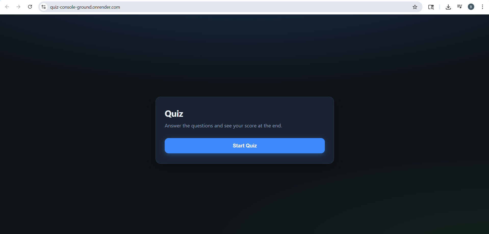
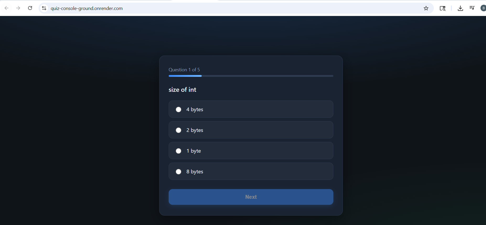
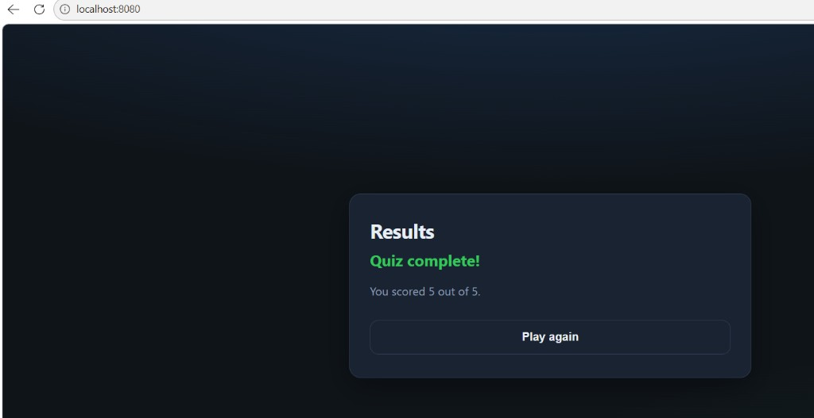

# Quiz Console Ground

An end-to-end quiz application that started as a Java console app and was upgraded into a full web project:

- `Spring Boot` backend with REST APIs
- `Vanilla HTML/CSS/JavaScript` responsive frontend
- `Maven Wrapper` for reproducible builds
- `Docker` support for cloud deployment

This repository is designed to demonstrate practical full-stack fundamentals with clean, beginner-friendly code.

## Live Demo

- **Application URL:** `https://<your-deployed-url>`
- **Repository URL:** `https://github.com/Dhanush-kumar-143/Quiz-Console-Ground`

> Update these 2 links after deployment so interviewers can open them directly.

---

## Screenshots

### Start Screen


### Question Screen


### Result Screen


> Add your images to `docs/screenshots/` with the same file names, or update the paths above.

---

## My Contribution / Impact

- Migrated a terminal-only Java quiz into a full web application.
- Built REST APIs and integrated them with a dynamic frontend.
- Implemented better user experience with loading/error states and clean UI flow.
- Made the project deployment-ready with Docker, Maven Wrapper, and env-based config.
- Improved project maintainability with modular backend layers and clear documentation.

---

## About Me (For Interviewers)

I built this project to demonstrate practical full-stack development skills across backend API design, frontend integration, and production-readiness.

I focused on:
- clear API contracts
- user-friendly frontend behavior
- deployable architecture and reproducible setup

I can explain design decisions, trade-offs, and next improvements in depth during interviews.

---

## What I Built

### 1) Backend API (Java + Spring Boot)
- Implemented quiz APIs:
  - `GET /api/questions`
  - `POST /api/submit`
  - `GET /api/results`
- Added quiz session logic to:
  - Load questions
  - Accept and validate answers
  - Calculate score
- Added CORS configuration for local + configurable production usage.

### 2) Frontend (Vanilla JS)
- Built a modern, responsive UI with:
  - Start screen
  - Question/option rendering
  - Next button flow
  - Final results screen
- Integrated frontend with backend APIs using `fetch()`.
- Added loading states and API error handling.

### 3) Developer + Deployment Setup
- Added `mvnw` / `mvnw.cmd` (Maven Wrapper) so contributors do not need global Maven installed.
- Added `Dockerfile` for containerized deployment.
- Configured app port from environment (`PORT`) for cloud platforms.

---

## Project Impact

This project demonstrates the ability to:

- Convert a command-line Java application into a web-based system
- Design and expose REST APIs with clean request/response models
- Build a framework-free frontend that consumes real APIs
- Add production-focused setup (env config, CORS strategy, Docker, build tooling)
- Deliver a complete feature from backend to UI with runnable instructions

---

## Tech Stack

- **Backend:** Java 17, Spring Boot 3
- **Frontend:** HTML5, CSS3, Vanilla JavaScript (ES6+)
- **Build Tool:** Maven + Maven Wrapper
- **Containerization:** Docker

---

## API Contract

### `GET /api/questions`
Returns all quiz questions (without exposing correct answers).

Example response:

```json
[
  {
    "id": 1,
    "question": "size of int",
    "options": ["4 bytes", "2 bytes", "1 byte", "8 bytes"]
  }
]
```

### `POST /api/submit`
Submits one selected answer.

Example request:

```json
{
  "questionId": 1,
  "selectedOption": "4 bytes"
}
```

### `GET /api/results`
Returns quiz score summary.

Example response:

```json
{
  "score": 5,
  "total": 5
}
```

---

## Run Locally

### Prerequisites
- JDK 17+
- Git

> Maven global install is optional (wrapper included).

### Steps

1. Clone the repo:

```bash
git clone <your-repo-url>
cd Quiz-Console-Ground
```

2. Ensure `JAVA_HOME` points to JDK 17.

3. Run the app:

```bash
./mvnw spring-boot:run
```

Windows:

```powershell
.\mvnw.cmd spring-boot:run
```

4. Open in browser:
- `http://localhost:8080`

---

## Run with Docker

```bash
docker build -t quiz-app .
docker run -p 8080:8080 quiz-app
```

Then open:
- `http://localhost:8080`

---

## Configuration

Defined in `src/main/resources/application.properties`:

- `server.port=${PORT:8080}`  
  Uses cloud `PORT` if provided, otherwise `8080`.

- `quiz.cors.allow-all=${QUIZ_CORS_ALLOW_ALL:false}`  
  For quick demos only (not recommended for sensitive production apps).

- `quiz.cors.additional-origins=${QUIZ_CORS_ORIGINS:}`  
  Comma-separated allowed origins for frontend hosted on another domain.

---

## Project Structure

```text
src/main/java/com/quiz
  QuizApplication.java
  QuestionBank.java
  config/WebConfig.java
  service/QuizSessionService.java
  web/QuizController.java
  dto/
  model/
  console/ConsoleQuizMain.java

src/main/resources
  application.properties
  static/
    index.html
    style.css
    script.js
```

---

## Key Design Notes

- Questions are stored in-memory through `QuestionBank`.
- Answers are stored in-memory in `QuizSessionService`.
- Current version is ideal for learning/demo and single-instance usage.

For enterprise scale, next steps would include:
- Persistent storage (PostgreSQL/MySQL)
- User authentication + per-user sessions
- Test coverage (unit/integration/E2E)
- CI/CD pipeline and observability

---

## Interview Talking Points

If you are discussing this project in interviews, highlight:

1. Why you migrated from console to web architecture.
2. How you designed API contracts for frontend-backend integration.
3. How you handled UX details (loading states, validation, error handling).
4. How you made the project deployable (Maven Wrapper, Docker, env-based config).
5. What you would improve next for production readiness.
